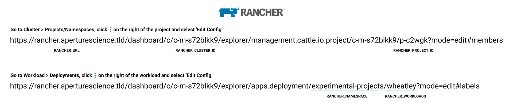

`rancher-redeploy-workload` is a GitHub action (and docker image) that redeploys kubernetes workloads using Rancher's API.

## Usage



### Running as a GitHub action

```yaml
  - name: Update rancher deployment
    uses: th0th/rancher-redeploy-workload@v0.9.3
    with:
      debug: 'false'
      disable_output: 'false'
      rancher_bearer_token: ${{ secrets.RANCHER_BEARER_TOKEN }}
      rancher_cluster_id: 'c-qxyky'
      rancher_namespace: 'namespace'
      rancher_project_id: 'p-hm2z1'
      rancher_url: 'https://rancher.aperturescience.tld'
      rancher_workloads: 'wheatley1,wheatley2'
      tls_skip_verification: 'false'
```

#### Inputs

| Variable              | Required | Default value | Description                                                                                          |
|-----------------------|:--------:|---------------|------------------------------------------------------------------------------------------------------|
| debug                 |          | 'false'       | Debug flag (useful when something fails)                                                             |
| disable_output        |          | 'false'       | Disables outputting to stdout (useful if the logs are public, but you don't want to expose anything) |
| rancher_bearer_token  |    ✓     |               | Bearer token used for authenticating on Rancher                                                      |
| rancher_cluster_id    |    ✓     |               | Cluster's id on Rancher                                                                              |
| rancher_namespace     |    ✓     |               | Kubernetes namespace of the deployment to be updated                                                 |
| rancher_project_id    |    ✓     |               | Project's id on Rancher                                                                              |
| rancher_url           |    ✓     |               | Base URL of the Rancher                                                                              |
| rancher_workloads     |    ✓     |               | Comma separated list of workloads to be updated (e.g. deployment1,deployment2)                       |
| tls_skip_verification |          | 'false'       | Skips TLS verification for the outgoing HTTP request to Rancher                                      |

### Running as a docker container

```shell script
$ docker run --rm -it \
    -e DEBUG="false" \
    -e DISABLE_OUTPUT="false" \
    -e RANCHER_BEARER_TOKEN="token-xgskl:n45p7tmd47t9lfzh7xl8rw6rvtrfzzxrtdr6qvjg27r4sjcxvzss7d" \
    -e RANCHER_CLUSTER_ID="c-qxyky" \
    -e RANCHER_NAMESPACE="namespace" \
    -e RANCHER_PROJECT_ID="p-hm2z1" \
    -e RANCHER_URL="https://rancher.aperturescience.tld" \
    -e RANCHER_WORKLOADS="wheatley1,wheatley2" \
    -e TLS_SKIP_VERIFICATION="false" \
    th0th/rancher-redeploy-workload:0.9.3
```

## Shameless plug

I am an indie hacker, and I am running two services that might be useful for your business. Check them out :)

### WebGazer

[](https://www.webgazer.io/?utm_source=github&utm_campaign=rancher-redeploy-workload-readme)

[WebGazer](https://www.webgazer.io/?utm_source=github&utm_campaign=rancher-redeploy-workload-readme) is a monitoring
service that checks your website, cron jobs, or scheduled tasks on a regular basis. It notifies
you with instant alerts in case of a problem. That way, you have peace of mind about the status of your service without
manually checking it.

### PoeticMetric

[](https://www.poeticmetric.com/?utm_source=github&utm_campaign=rancher-redeploy-workload-readme)

[PoeticMetric](https://www.poeticmetric.com/?utm_source=github&utm_campaign=rancher-redeploy-workload-readme) is a
privacy-first, regulation-compliant, blazingly fast analytics tool.

No cookies or personal data collection. So you don't have to worry about cookie banners or GDPR, CCPA, and PECR
compliance.

## License

Copyright © 2020, Gökhan Sarı. Released under the [MIT License](LICENSE).
